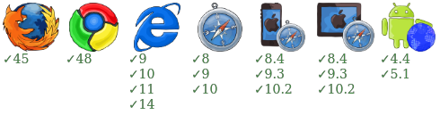

with-promise
===================

An extended promise to keep the context persistently

[](https://www.npmjs.org/package/with-promise) [](https://david-dm.org/zordius/with-promise) [](https://travis-ci.org/zordius/with-promise) [](https://codeclimate.com/github/zordius/with-promise) [](https://codeclimate.com/github/zordius/with-promise) [](LICENSE.txt)

[](https://saucelabs.com/u/zordius_oss)

Installation
------------

```sh
npm install with-promise
```

In browser:
```html
<script src="dist/with-promise.js"></script>
```

In an AMD loader:
```javascript
require('with-promise', function (WithPromise) {/*....*/});
```

In nodejs:
```javascript
var WithPromise =  require('with-promise');
```

Features
--------

* Extended Promise, make all `.then()` , `.catch()` handlers be executed with your assigned context: `this` .

Notice
------

**You should use polyfills** providing Promise to ensure with-promise works well. You can try <a href="http://polyfill.io">polyfill.io</a> or <a href="http://polyfills.io/">polyfills.io</a>. For nodejs, you can try <a href="https://github.com/jakearchibald/es6-promise">es6-promise</a> or <a href="https://github.com/yahoo/ypromise">ypromise</a>.

Usage
-----

```javascript
var WithPromise = require('with-promise');

// create a Promise by a resolver function and set context
var myPromise = WithPromise.create(resolver, context);

// create a resolved Promise
var myPromise = WithPromise.resolve(value, context);

// create a rejected Promise
var myPromise = WithPromise.reject(value, context);

// all this == context
myPromise.then(function () {
    // this == context
}).then(function () {
    // this == context
}).catch(function () {
    // this == context
});
```
